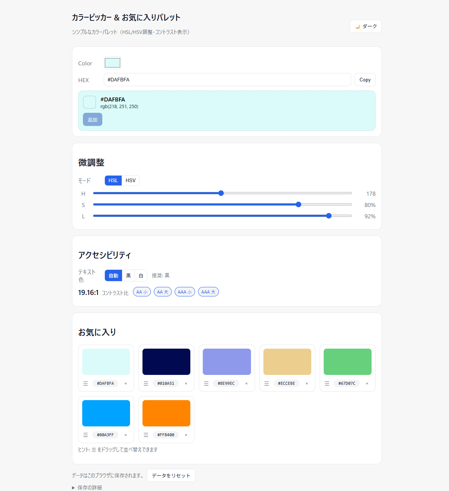

# Color Picker & Palette

HSL/HSV の調整・コントラスト表示つきのカラーパレット（React + Vite）。

## デモ

公開URL:

## 主な機能

- Color input + HEX 入力/コピー
- HSL/HSV スライダーで調整
- コントラスト比表示（AA/AAA 判定）とテキスト色の自動/黒/白切替
- お気に入りに追加・ドラッグ＆ドロップで並べ替え（localStorage 永続化）
- ライト/ダークのテーマ切替
- 「データをリセット」ボタン（localStorage クリア）

## スクリーンショット



## クイックスタート

```bash
npm i
npm run dev
```

## スクリプト

- `dev` 開発サーバ
- `build` 本番ビルド
- `preview` ビルドのプレビュー
- `check` Prettier & ESLint チェック
- `format:check` / `format:fix`
- `lint` / `lint:fix`

## 技術スタック

- React + Vite
- ESLint v9（Flat Config）/ Prettier
- localStorage（キー: `cpp.favorites`, `cpp.theme`）

## デプロイ（GitHub Pages）

- `vite.config.js` の `base` を `'/color-picker-palette/'` に設定
- GitHub Actions（`deploy.yml`）が `main` への push で自動デプロイ

# React + Vite

This template provides a minimal setup to get React working in Vite with HMR and some ESLint rules.

Currently, two official plugins are available:

- [@vitejs/plugin-react](https://github.com/vitejs/vite-plugin-react/blob/main/packages/plugin-react) uses [Babel](https://babeljs.io/) for Fast Refresh
- [@vitejs/plugin-react-swc](https://github.com/vitejs/vite-plugin-react/blob/main/packages/plugin-react-swc) uses [SWC](https://swc.rs/) for Fast Refresh

## Expanding the ESLint configuration

If you are developing a production application, we recommend using TypeScript with type-aware lint rules enabled. Check out the [TS template](https://github.com/vitejs/vite/tree/main/packages/create-vite/template-react-ts) for information on how to integrate TypeScript and [`typescript-eslint`](https://typescript-eslint.io) in your project.
